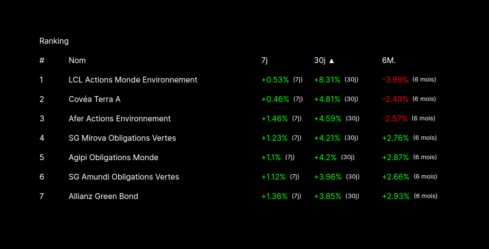
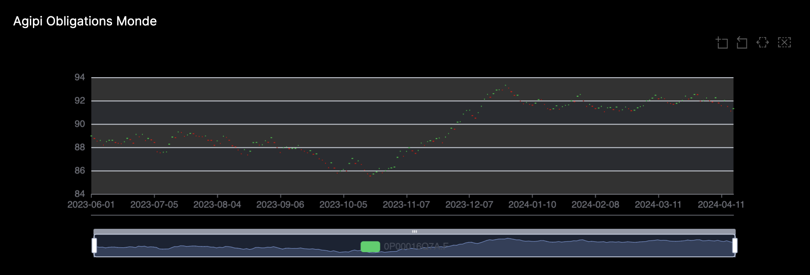

# Green Assets Ranking App

## Import Data

Default database credentials are set in `db-clients.ts`:

```bash
{
    host: process.env.CLICKHOUSE_HOST ?? "http://localhost:8123",
    username: process.env.CLICKHOUSE_USER ?? "default",
    password: process.env.CLICKHOUSE_PASSWORD ?? "",
}
```

```bash
# Start the clickhouse database (user: default) under 127.0.0.1:8123
docker compose up -d
```

```bash
nvm use
cd src/import
npm ci

# Import/reset data
# Be warned this is gonna DROP existing data:
FROM="2022-06-01" npm run import
```

## Install and start app

```bash
nvm use
cd src/ranking-app
npm ci
```

And then start the app:

```bash
npm run dev
```




